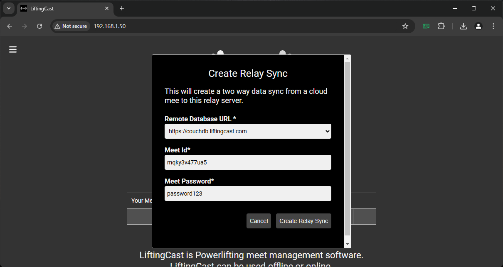

# liftingcast-local-relay-server

A docker based LiftingCast local server that acts as a relay to the cloud database

## Precaution

This is an advanced tool that may not be appropriate for every meet setup. This tool provides a local data relay point to the online cloud database that can improve local network stability and speed. This can greatly improve the performance of the clock and tablet based ref lights. But this local-relay-server also introduces another point of failure and requires more advanced networking knowledge. Use at your own risk.

## Prerequisites

You should be familiar with basic networking and Docker Desktop before using this product. You must setup a private network at the venue that only the meet staff has access to. You should use ethernet over wifi whenever possible to connect devices.

## How To

It is recommended that the computer running this service have a static IP address. This is often best configured in your routers configuration by reserving an IP address for this computer.

Install Docker Desktop
https://docs.docker.com/desktop/

Docker Desktop for Microsoft Windows will require you to first enable WSL
https://learn.microsoft.com/en-us/windows/wsl/install

For all of these commands you can use the built in terminal in Docker Desktop.

### WINDOWS ONLY - Enter WSL

On Windows only enter WSL.

```
wsl
```


### WINDOWS ONLY - Change to linux filesystem

If you are using Windows with WSL for best performance make sure you are in a linux directory such as `/home/YOUR_USER`. Don't use the Windows mounted directors that start with `/mnt`.


### Download docker-compose config file

From this repository copy the compose.yml file into a directory on your computer. You can download this file directly or use git.

```
git clone https://github.com/liftingcast/liftingcast-local-relay-server.git
```


### Enter directory containing docker-compose config

From a terminal cd into the directory containing the compose.yml file. You can use the built in terminal in Docker Desktop.

```
cd liftingcast-local-relay-server
```


### Start Docker containers

Run the docker-compose command to start the service. This launches two containers, one for the data relay and one for the local webserver to access the LiftingCast software.

```
docker-compose up
```


You can now manage the running containers from the "Containers" tab of Docker Desktop.


### Determine your computers local network IP address

Get the relay server's local network IP address. Either you set this in your router already or you can find it using various methods depending on your operating system. `ifconfig` (Mac and Linux) and `ipconfig` (Windows) can be useful commands for finding your IP address. Local address IP addresses often start with 192. or 10. but that is not always the case. On windows be careful not to pick the internal WSL IP address.


### Sync a meet

In a web browser visit the local LiftingCast webserver.

```
http://YOUR.LOCAL.IP.ADDRESS/
```

For Example if your local IP address is 192.168.1.2 visit http://192.168.1.2/

From local LiftingCast homepage you can add and manage data syncs between cloud LiftingCast servers and this local relay. You'll need the meetID and password to create a sync. You can find the meetID on the LiftingCast meet setup page.





## Advanced DNS

You can run your own local DNS server and set a hostname for the local LiftingCast webserver. For example if you point local.liftingcast.com to 192.168.1.2 you can visit http://local.liftingcast.com instead of an IP address based URL.

## Updating

To get the latest version of the LiftingCast software stop all running containers and run this command.

```
docker-compose pull
```

You may want to delete the containers and start fresh before pulling new images. It is possible that new images may not work with your existing containers.

## Troubleshooting

### Internet outage

If you lose internet access temporarily the sync will stop. It will retry on its own to reestablish the connection and this can take several minutes. If the internet is down for a long enough period the sync may enter a failure state. You can try to restart the sync from the local LiftingCast homepage. If that doesn't work try restarting the Docker containers.

### Password change

If you change your password in the online cloud database you will need to delete and re-setup your sync.

### Removing old meets

You can delete meets from the local LiftingCast server from the local LiftingCast homepage. You can also delete the Docker container and start a new one.
